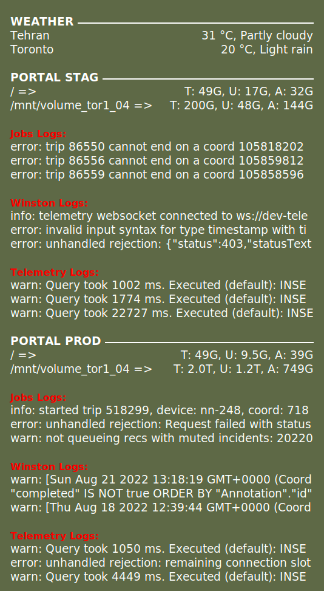
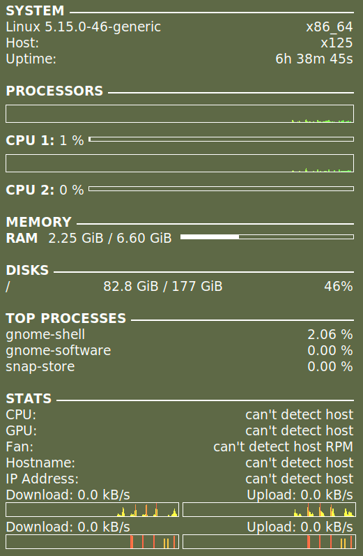

# conky widgets

**PS.**

Please move all content to your user home `.conky` folder

##### `left.conkyrc`

- **Weather** => Tehran, Toronto
- **Portal Stag** => disk usage and container logs
- **Portal Prod** => disk usage and container logs

---

##### `right.conkyrc`

- **System** => kernel, host name, uptime
- **Processors (CPUs)** => graph, and percentage
- **Memory** => RAM usage
- **Disks** => disk usage
- **Top Processes** => top three processes
- **Stats** => CPU and GPU temperature, fan speed, public ip address, download and upload speed and graph for two networks

---

##### `.conky/launch`
launch conky widgets based on the available connected monitors

