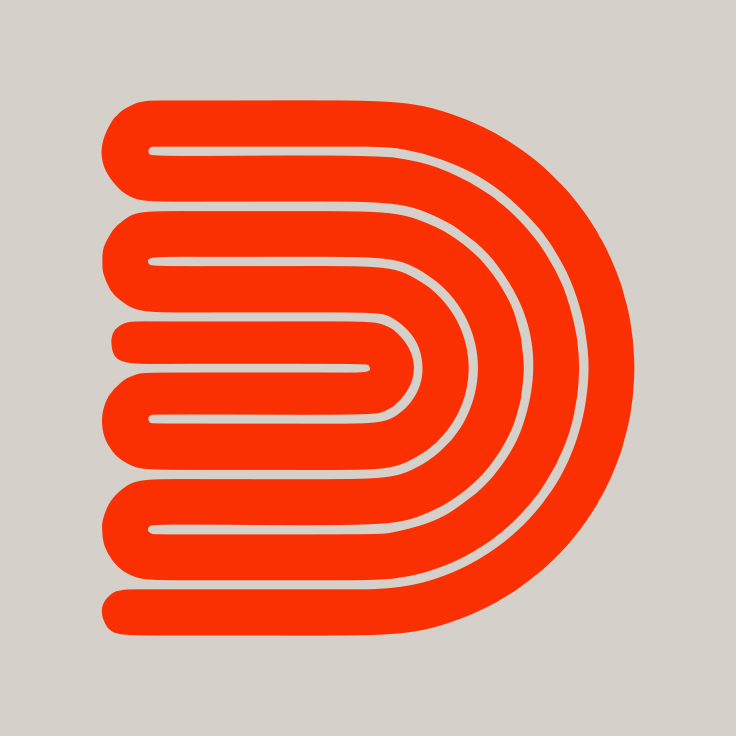
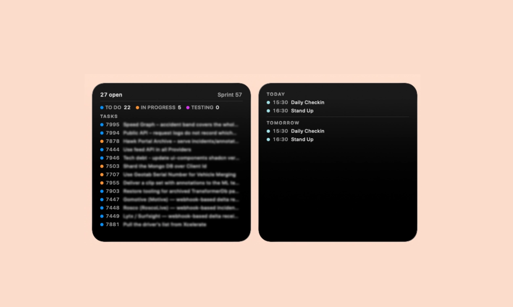
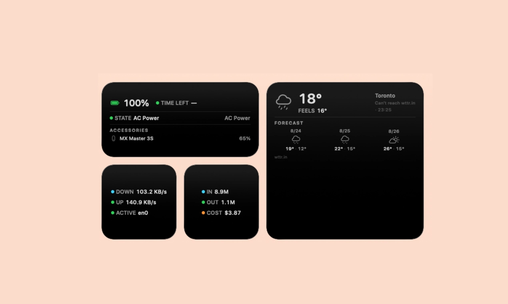
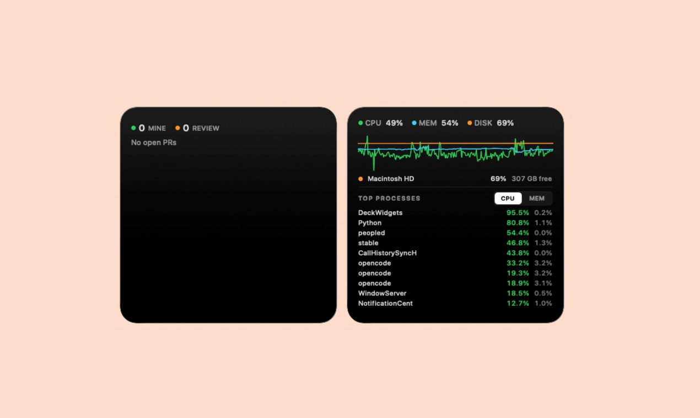
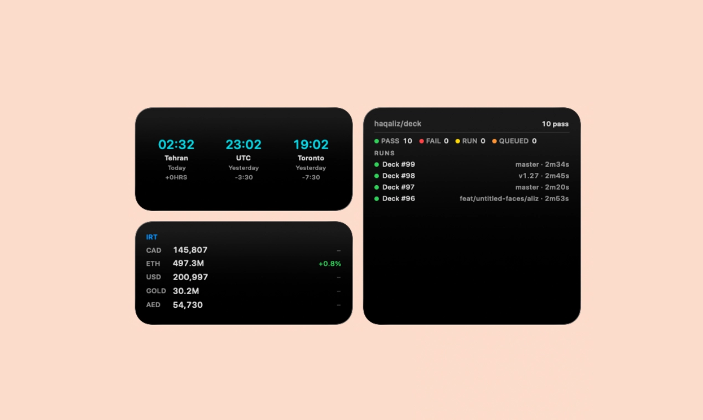
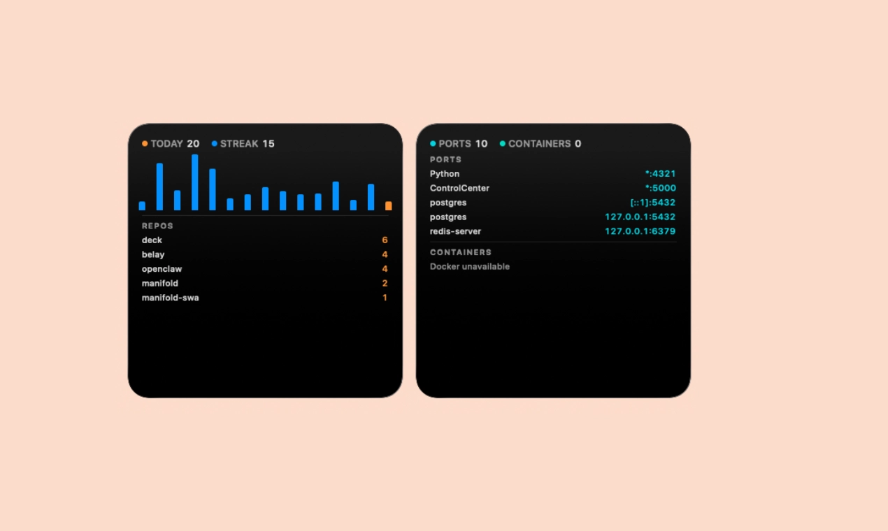
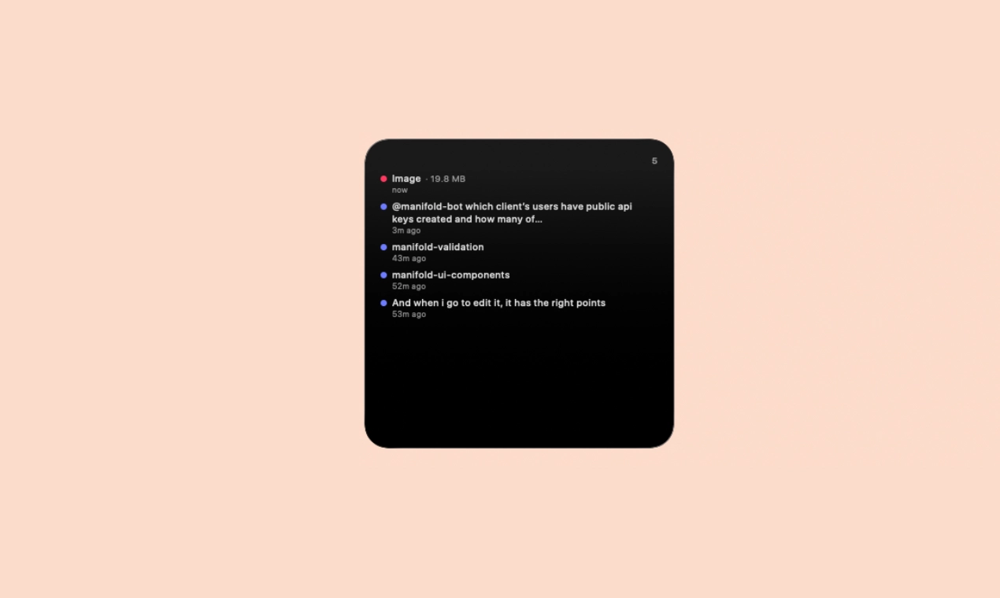

<div align="center">



# Deck

**Fourteen small, beautiful macOS desktop widgets — one native app, no floating windows.**

Deck adds real WidgetKit widgets to your desktop: your machine, your network, your
battery, your commits, your ports, your calendar, your tasks, your builds and your
review queue — with
native colors, corners and materials, at three sizes each.

[](https://github.com/haqaliz/deck/releases/latest)
[](https://github.com/haqaliz/deck/actions/workflows/deck.yml)
[](LICENSE)
[](https://www.apple.com/macos/)
[](https://swift.org)
[](https://developer.apple.com/documentation/widgetkit)
[](https://github.com/haqaliz/deck/releases)
[](CONTRIBUTING.md)

[Screenshots](#screenshots) · [Install](#install) · [Widgets](#widgets) · [Settings](#settings) · [Privacy](#privacy) · [How it works](#how-it-works) · [Troubleshooting](#troubleshooting) · [Contributing](CONTRIBUTING.md) · [Roadmap](ROADMAP.md)

</div>

---

## Screenshots

<div align="center">










</div>

---

## Widgets

| Widget | Shows |
|---|---|
| **LiveBox** | CPU / MEM / DISK usage with a live chart (per-core CPU lines) and top processes (CPU/MEM tabs); metric rows and chart lines turn amber/red past each metric's own warn/alarm thresholds; the large widget can list per-volume disk rows (internal + external volumes) instead of the aggregate DISK row; the process list refreshes at your chosen cadence (default 15s); an optional thermal-pressure row (off by default) shows the system state as NOMINAL/FAIR/SERIOUS/CRITICAL |
| **OpenBox** | opencode usage: today's in/out tokens + cost, 14-day chart (tokens or cost-per-day stacked by model), top models, tool usage counts, top sessions by tokens; in remote mode a failed fetch says why |
| **NetBox** | per-interface up/down rates, history chart, most active interfaces; rates turn amber/red past your warn/alarm thresholds |
| **BatBox** | battery level, time remaining, charge state, and Bluetooth accessory batteries detected automatically |
| **GitBox** | commits per day (14 days), today's count, streak, active repos |
| **DevBox** | open TCP listening ports (process + port) and running Docker containers (CPU/mem) |
| **ClipBox** | clipboard history: recent copies with previews, item kinds, relative times |
| **WeatherBox** | weather for your location (conditions + 3-day forecast); a failed fetch says why |
| **ClockBox** | world clocks for up to six cities (3 on medium, 6 on large): time, relative day, offset from your own zone |
| **ShipBox** | GitHub Actions runs across up to five repos, newest first: status dots, durations, totals; clickable rows; a failed fetch says why |
| **TaskBox** | Azure DevOps work items assigned to you (click a row to open the work item): open count, current sprint, board-lane legend (to do / in progress / testing) and up to 15 recent items; a failed fetch says why |
| **CalBox** | two sections, TODAY and TOMORROW (click an event with a video call to join it), from every calendar macOS syncs (Google, iCloud, Exchange, CalDAV); each section shows/hides and sizes independently |
| **PRBox** | your open pull requests and the ones awaiting your review, mixed from GitHub and Azure DevOps in one queue: counts, provider-tagged rows, drafts marked; click a row to open the PR; a failed fetch names the provider |
| **MarketBox** | live prices for your tickers — crypto (with 24h change), fiat like USD/CAD, and gold per gram — all priced in the display currency you pick (USD, IRR or IRT/Toman, converted at the free-market rate) |

All fourteen come in **small / medium / large** sizes.

## Install

### Homebrew (recommended)

```bash
brew install --cask --no-quarantine haqaliz/deck/deck
```

### Download

Grab `Deck-vX.Y.dmg` from the [latest release](https://github.com/haqaliz/deck/releases/latest),
open it, and drag **Deck** to Applications. Then clear the quarantine flag once
and launch:

```bash
xattr -dr com.apple.quarantine /Applications/Deck.app
open /Applications/Deck.app
```

Finally: right-click the desktop → **Edit Widgets…** → search "Deck" → add the
widgets you want. Each comes in small, medium and large.

> **Why the extra command?** Deck is signed with an Apple Development
> certificate and is **not notarized yet**, so macOS quarantines it on download
> and refuses to open it. On macOS 15 the old Control-click → Open shortcut is
> gone, so it is the command above or System Settings → Privacy & Security →
> **Open Anyway** after a blocked launch. `--no-quarantine` is Homebrew doing
> the same thing for you. Notarization is the next release milestone; when it
> lands, both of these disappear.

Verify a download against `SHA256SUMS.txt` on the release.

### Build from source

Requires macOS 15+, Xcode 16+, and an Apple signing identity — a free Apple ID
works, but ad-hoc and self-signed extensions are rejected by `pluginkit` and
never appear in the Widget Center.

```bash
brew install xcodegen
xcodegen generate --spec native/project.yml
xcodebuild -project native/Deck.xcodeproj -scheme DeckApp -configuration Release \
  -derivedDataPath native/build.noindex -allowProvisioningUpdates \
  -allowProvisioningDeviceRegistration build

rm -rf /Applications/Deck.app
cp -R native/build.noindex/Build/Products/Release/Deck.app /Applications/
open /Applications/Deck.app            # first run installs the refresh agent
scripts/lsclean.sh                     # required after every release build
pluginkit -m -i com.deck.app.widgets   # verify the extension registered
```

See [CONTRIBUTING.md](CONTRIBUTING.md) for the full development guide.

## Settings

Settings live in the **Deck app** (one tab per widget): show/hide chart,
metrics, lists; colors; counts; OpenBox token + server URL (remote mode);
GitBox repo paths + scan depth. Changes apply to the widgets immediately.

- **OpenBox remote mode:** set a Server URL (e.g. `http://host:4096`) and paste
  your own token — no default token is ever sent, and without a pasted token
  remote mode fetches nothing (it won't fall back to the local DB). OpenBox
  then fetches usage over HTTP from an `opencode serve` instance (basic auth,
  username `opencode`). The chart can switch between token lines and a
  cost-per-day view stacked by model (OpenBox tab → "Cost-per-day chart", off
  by default). The large face can also list the top sessions of the last 14
  days by tokens (OpenBox tab → "Show sessions", off by default).
- **LiveBox** reads mach, getifaddrs-style samplers and IOKit directly inside
  the widget — including the optional thermal row, which reads
  `ProcessInfo.thermalState` (a coarse pressure level, not a temperature: macOS
  exposes no fan speed or degrees without private SMC access); the top-process rows come from the background agent (ps) and
  refresh at your "Process refresh" interval (5–60s, default 15s — the widget
  tick and the fast process agent `com.deck.agent.processes` follow it).
- **NetBox** reads only the interface you pin in settings (default: automatic
  "most active" pick — pinning falls back to automatic while that interface is
  offline). Rates past your warn/alarm thresholds (MB/s, NetBox tab) turn
  amber/red; idle or no-reading rates are never tinted.
- **GitBox** reads only the repo paths you configure (empty by default — add
  comma-separated paths in settings).
- **ClipBox** history lives local-only in the widget container (plaintext, up
  to 20 items); clear it from the ClipBox settings tab.
- **WeatherBox** fetches weather from wttr.in via the agent (empty location =
  auto geolocate).
- **ClockBox** needs no data source at all: it resolves `TimeZone` and `Date`
  inside the widget, so it works with the agent stopped and the network down.
  Its timeline carries an hour of entries on minute boundaries, so the displayed
  minute is never stale.
- **ShipBox** needs a GitHub token in settings — without one nothing is fetched
  (the token goes only to api.github.com over TLS). It watches up to five repos
  and merges their runs into one newest-first list, with the repo on each row.
  Two modes, chosen in the ShipBox tab: **Automatic** (the default) watches the
  repos you pushed to most recently that have any Actions runs, so the set
  changes as you push; **Pick repos** gives you five slots, each a picker over
  the repos your token can see. A repo that fails while the others succeed
  doesn't blank the widget — its runs are simply absent and a note names it.
  Runs refresh via the agent every 60s, and clicking a row opens that run.
- **MarketBox** tickers are picked from a list, not typed: twelve slots in the
  MarketBox tab, each a picker over the curated symbols (crypto, fiat codes,
  and `GOLD` for 1 gram of gold — slot order is display order). Prices are
  priced in one display currency, picked from a list: **USD**, **IRR**
  (Iranian Rial), **IRT** (Toman — the free-market rate, IRT = IRR ÷ 10),
  **CAD**, **EUR** or **AED** (live FX rate). The small widget shows up to
  4 rows price-only; medium shows up to 5 with the 24h change; large shows up
  to 12. Crypto rows carry the change; fiat and gold rows are price-only. No
  API key is needed anywhere; prices come from
  CoinGecko (crypto), gold-api (gold), Wallex (free-market Toman) and
  open.er-api (fiat cross-rates), fetched by the agent every 60s. A symbol
  outside the curated list is shown, not dropped: `Unknown: XRPX`.
- **TaskBox** needs an Azure DevOps organization, a project and a personal
  access token in settings — without all three nothing is fetched (the token
  goes only to dev.azure.com over TLS, and a read-only *Work Items (Read)*
  scope is enough). It shows open work items assigned to whoever owns the PAT,
  not whoever is signed in to the browser, and only in the project you
  configure. The header gives the total open count and your current sprint.
  Refreshes via the agent every 60s.
- **TaskBox lanes** are configurable. Azure DevOps runs two vocabularies on one
  board — tasks move `To Do → In Progress`, while backlog items move
  `New → Approved → Committed` — so the TaskBox tab has a comma-separated,
  case-insensitive list per lane (*to do / in progress / testing / done*) that
  collapses both. Edit them if your process template renames states, or use
  **Reset to defaults**. A state in none of the lists is counted under `OTHER`
  rather than dropped, so the legend always adds up to the tasks it describes;
  `DONE` and `OTHER` only appear when something lands there.
- **TaskBox rows** are `● number  title`. Only completed items carry a
  checkmark (struck through and dimmed) — everything else leaves the slot empty
  so the work item numbers stay in one column. The dot colour is the lane. The
  list holds up to 15 items on the large widget; the medium one caps at 6,
  because past that the rows would be clipped by the frame rather than by your
  setting.
- **TaskBox has no due dates, on purpose.** Azure DevOps populates no
  dependable due field: `DueDate` and `TargetDate` are sparse, and falling back
  to the sprint end gave every item in a sprint the same meaningless date.
  Progress through the board is the real signal.
- **CalBox** reads your calendars through EventKit, so it shows whatever macOS
  already syncs — add a Google account in System Settings → Internet Accounts
  and it appears alongside iCloud, Exchange and CalDAV. Nothing is fetched from
  Google directly and no OAuth is involved. macOS asks for calendar access
  twice, once for Deck and once for its background agent: they are separately
  signed, so each needs its own grant. Writable calendars start ticked and
  read-only ones (holidays, birthdays, subscriptions) start off, so their
  all-day entries don't crowd out real events — change that in the CalBox tab.
  Events stay in the widget container and are never sent anywhere.
- **CalBox sections** are independent: show or hide TODAY and TOMORROW, and set
  each one's row count up to 10. Small and medium widgets show fewer rows than
  those counts, because past that the rows would be clipped by the frame rather
  than by your setting. All-day events sit at the top of TODAY and spend the
  section's budget before timed events do.
- **When a fetch fails**, ShipBox, TaskBox, CalBox, WeatherBox and OpenBox (remote
  mode) say why in one short line instead of a generic "no data": *"Add a repo + token in
  settings"* (nothing configured), *"Check repo + token"* / *"Check the
  location"* (credentials or target wrong — 401/403/404), *"Can't reach
  GitHub"* (offline, rate-limited, or the service is down), *"Unexpected
  GitHub response"* (reached it, couldn't parse it). If the background agent
  itself hasn't run for half an hour the line reads *"Agent hasn't run"*.
  These widgets no longer blank out data that has gone stale — whatever was
  last fetched stays on screen with its timestamp and the reason, so a broken
  token never silently empties a widget that was working a minute ago. The
  reason clears itself on the next successful fetch. The same reason appears in
  the widget's settings tab as a full sentence, right under the field that
  causes it, and clears the moment you edit that field.

## How it works

- **Self-sampled widgets** (LiveBox/NetBox/BatBox) read mach, getifaddrs and
  IOKit directly inside the widget — no other process needed.
- **Agent-pumped data** (OpenBox, process list, GitBox, ClipBox, weather,
  ShipBox, TaskBox, CalBox, PRBox, MarketBox): the widget
  sandbox forbids subprocesses and reading other apps' data, so a silent CLI
  (`DeckAgent`, embedded in the app) runs every 60s via a LaunchAgent and
  writes snapshots the widgets render. The top-process snapshot is sampled
  faster by a dedicated LaunchAgent (`com.deck.agent.processes`, default 15s).
  ClipBox captures the pasteboard on each tick — consecutive copies within a
  minute collapse to the newest.
- Everything refreshes on a ~60s cadence (WidgetKit throttles faster requests
  on macOS).

## Privacy

Deck reads personal data, so here is exactly what happens to it.

**What leaves your machine — only what you configure, only to where you point it:**

| Widget | Sends | To |
|---|---|---|
| WeatherBox | your location (or nothing, and your IP geolocates) | `wttr.in` |
| ShipBox | your GitHub token, and the repos you watch (or, in Automatic mode, your repo list) | `api.github.com` |
| TaskBox | your Azure DevOps PAT, org and project | `dev.azure.com` |
| OpenBox (remote mode only) | your token | the `opencode serve` URL you set |
| MarketBox | the symbols you typed (e.g. `BTC, USD, GOLD`) | `api.coingecko.com`, `api.gold-api.com`, `api.wallex.ir`, `open.er-api.com` |

MarketBox sends only the ticker symbols you typed — no tokens, no identity, and
it never sends anything on behalf of a row's price.

Nothing else makes a network request. There is no analytics, no telemetry, no
crash reporting, and no Deck server — the project has no backend at all. The
other eight widgets never touch the network.

**What stays on disk:** every snapshot lives in the widget's own container at
`~/Library/Containers/com.deck.app.widgets/Data/Library/Application Support/Deck/`.
Calendar events, work items, clipboard history, commit counts and process lists
are written there and read by the widgets. Nothing is uploaded.

**Clipboard.** ClipBox skips any copy marked `ConcealedType`, `TransientType`
or `AutoGeneratedType` — the convention password managers use precisely so that
history tools ignore them — so passwords copied from 1Password, Bitwarden,
KeePassXC or Keychain Access are never recorded. Everything else it does keep is
plain text, capped at 20 items, and clearable from the ClipBox settings tab.

**Credentials** are managed in one place: **Deck → Settings → Credentials**.
An account has a type (GitHub, Azure DevOps, opencode), a name you choose, and
whatever identifies the connection — an Azure organization and project, an
opencode server URL. You can keep as many accounts of a type as you like, and
each widget picks which one it uses from its own tab, so switching between two
opencode servers or two GitHub identities is a dropdown rather than a re-paste.
One account can serve several widgets: ShipBox and PRBox can share a single
GitHub token instead of holding two copies of it.

The tab works like System Settings' Internet Accounts: a list of accounts with
a chevron on each, **Add Account…** to pick a provider (searchable — "ado" and
"vsts" find Azure DevOps), and a page per account reached by clicking its row,
with back and forward in the toolbar.

**Verify** on an account asks the provider who the credential belongs to —
a GitHub login, an Azure display name, a reachable opencode server — so a token
that has expired or lacks a scope says so where you pasted it, rather than as a
silent empty widget. It stays greyed out until the account has what the probe
needs, and says which field is missing.

**opencode is different from the other two, and it matters here.** Its token is
HTTP Basic auth against **your own** `opencode serve` instance, not an account
on a shared service — so Verify needs the server URL before it can run, because
without one there is no host to ask. That same URL is what puts OpenBox in
remote mode: no account means the local opencode database, an account with a
server URL means that server.

**Tokens** are stored in your **login keychain**, not in a file: one keychain
item per account, written by the settings window and read by the background
agent. `settings.json` keeps only the non-secret fields and stays
owner-readable (mode 0600). An older Deck that kept tokens in that file, or in
the five per-widget slots that predated accounts, migrates them the first time
you open the new version — nothing to re-paste.

To be precise about what that buys: the tokens are no longer sitting in a
plain-text file that backups, folder copies and sync tools pick up. It is
**not** a barrier against other software running as you — anything running
under your account can ask the keychain for them, the same as it could read the
file. Use read-only scopes (for Azure DevOps, *Work Items (Read)* is enough).

**Permissions macOS will ask for:** calendar access (CalBox) and "access data
from other apps" (the process list runs `ps`). Deck and its background agent are
signed separately, so macOS asks once for each. Deny them and only those two
features go dark.

**Uninstalling** is a button: Deck → Settings → General → Uninstall removes the
background agents, and "Erase Deck data" deletes every snapshot, setting and
token.

## Troubleshooting

**Every widget shows grey placeholder blocks instead of text** (charts still
draw, all sizes affected). LaunchServices is resolving `com.deck.app` to a
stale dev build — chronod rejects every render with `bundleStubNotSupported` /
"Bundle version did not match". Run:

```bash
scripts/lsclean.sh    # unregisters dev copies, re-registers /Applications/Deck.app, restarts chronod
```

Building into `native/build.noindex` (as above) keeps new dev copies from being
registered in the first place.

**A widget says "Check repo + token" or "Agent hasn't run".** That is the
widget reporting the last fetch, not a bug: fix the token/repo/location in Deck
settings (the app refreshes immediately, so the line clears within seconds), or
check the agent is loaded with `launchctl list | grep com.deck.agent`. Reasons
are recorded per source in `fetch-{shipbox,weather,opencodeRemote}.json` inside
the widget container.

## Uninstall

Installed with Homebrew:

```bash
brew uninstall --cask deck        # app + background agents
brew uninstall --zap --cask deck  # also erases settings, snapshots and tokens
```

Otherwise, in the app: **Deck → General → Uninstall** — "Remove background
agents" stops and deletes both LaunchAgents, "Erase Deck data…" clears every
snapshot, setting and token. Then remove the widgets from your desktop and drag
Deck to the Trash.

By hand, if you prefer:

```bash
launchctl bootout gui/$(id -u)/com.deck.agent
launchctl bootout gui/$(id -u)/com.deck.agent.processes
rm -f ~/Library/LaunchAgents/com.deck.agent.plist
rm -f ~/Library/LaunchAgents/com.deck.agent.processes.plist
rm -rf /Applications/Deck.app
rm -rf ~/Library/Logs/Deck
```

Remove the widgets from your desktop **before** uninstalling, and leave the
widget container alone unless you mean to erase your settings — see the note in
`CLAUDE.md` about why `rm -rf` on the container breaks every widget permanently.

## CI & Releases

- **CI**: every push/PR runs the workflow in `.github/workflows/deck.yml` —
  installs xcodegen, generates the project, and builds Release. With the signing
  secrets configured it signs and auto-provisions; without them it builds
  unsigned (compile check only — unsigned widgets can't register in `pluginkit`).
- **Releases**: push a `v*` tag (e.g. `git tag v1.20 && git push origin v1.20`) to
  build, sign, package `Deck-vX.Y.dmg` (with `SHA256SUMS.txt`) and publish it to a
  GitHub Release, install instructions included.
  Required secrets: `APPLE_CERT_P12_BASE64`, `APPLE_CERT_PASSWORD`, `APPLE_ID`,
  `APPLE_APP_SPECIFIC_PASSWORD`, `APPLE_TEAM_ID` (see the workflow header).
- **Notarization** is not enabled yet — see
  [`docs/planning/notarization/runbook.md`](docs/planning/notarization/runbook.md)
  for exactly what changes the day the paid Apple Developer Program is in place,
  and why the current signature stops validating on 2027-08-09.

## Development

```bash
xcodegen generate --spec native/project.yml   # after project.yml changes
                                              # AND after adding any source file
xcodebuild -project native/Deck.xcodeproj -scheme DeckApp -configuration Release \
  -derivedDataPath native/build.noindex build         # build
```

The Xcode project regenerates from `native/project.yml` (DeckApp host,
DeckWidgets extension, DeckAgent CLI, Shared models).

**Soak test:** `scripts/soak.sh` stresses the agent write paths (400 agent
runs + 50 overlapping launches, JSON integrity + exit-code assertions) and
runs in a few minutes; it isolates the LaunchAgents and the snapshot
container during the run and restores them afterwards. For the full 24h
stability soak see `docs/planning/crash-robustness-pass/runbook-24h.md`.

## Contributing

Issues and pull requests are welcome — see [CONTRIBUTING.md](CONTRIBUTING.md)
for the development guide, the two data paths, and the platform traps that will
otherwise cost you a day. Participation is covered by the
[Code of Conduct](CODE_OF_CONDUCT.md).

## License

[Apache License 2.0](LICENSE) © 2026 Ali Haqiqi. See [NOTICE](NOTICE).
